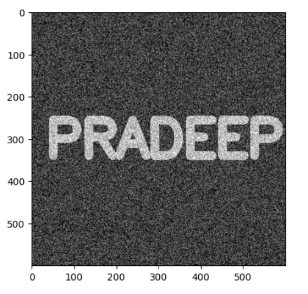
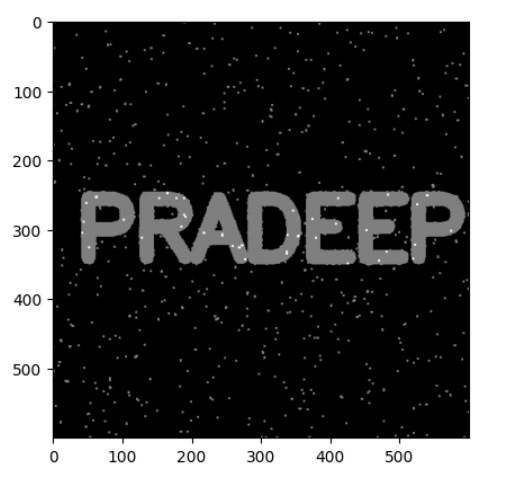
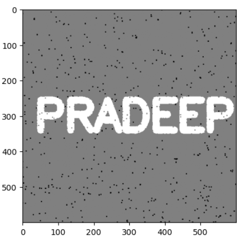

# OPENING--AND-CLOSING--Using--OpenCV
## Aim
To implement Opening and Closing using Python and OpenCV.

## Software Required
1. Anaconda - Python 3.7
2. OpenCV
## Algorithm:
### Step1:
Import the necessary packages.


### Step2:
Create the Text using cv2.putText.


### Step3:
Create the structuring element.

### Step4:
Use Opening operation.

### Step5:
Use Closing Operation.

 
## Program:
```
Developed By : Krishna Prasad S
Register No. : 212223230108
```

``` Python

# Import the necessary packages
import cv2
import numpy as np
from matplotlib import pyplot as plt


# Create a blank black image
img = np.ones((600, 600))
plt.imshow(img, cmap='gray')


# Create the Text using cv2.putText
def load():
    cv2.putText(img, text='KRISHNA', org=(35, 340), fontFace=cv2.FONT_HERSHEY_SIMPLEX, fontScale=4, color=(255, 255, 255), thickness=20)

def display_img():
    plt.imshow(img,cmap='gray')

load()
display_img()


# Create the structuring element
kernal = np.ones((3,3))


# Use Opening operation
white_noise = np.random.randint(0, 2, size = (600, 600))
white_noise

white_noise = white_noise * 255
noise_img = white_noise + img

plt.imshow(noise_img, cmap = 'gray')

opening = cv2.morphologyEx(noise_img, cv2.MORPH_OPEN, kernal)
plt.imshow(opening, cmap = 'gray')


# Use Closing Operation
close = cv2.morphologyEx(noise_img, cv2.MORPH_CLOSE, kernal)
plt.imshow(close, cmap = 'gray')

```
## Output:

### Display the input Image


### Display the result of Opening


### Display the result of Closing


## Result
Thus the Opening and Closing operation is used in the image using python and OpenCV.